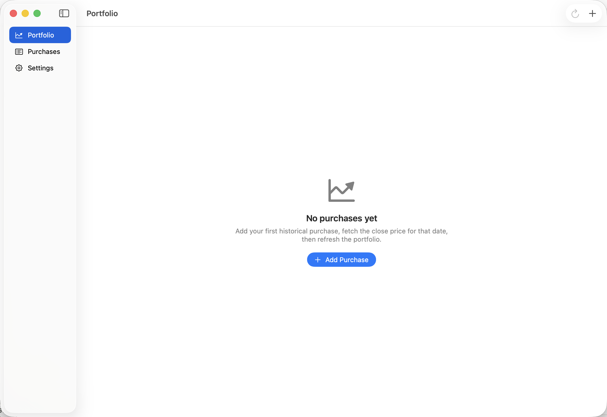
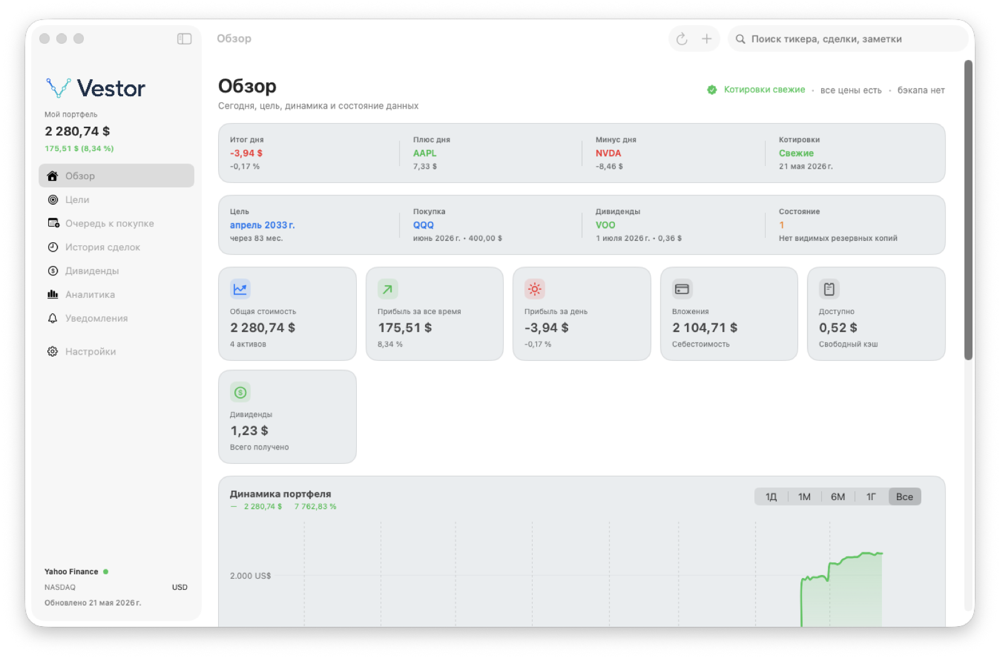
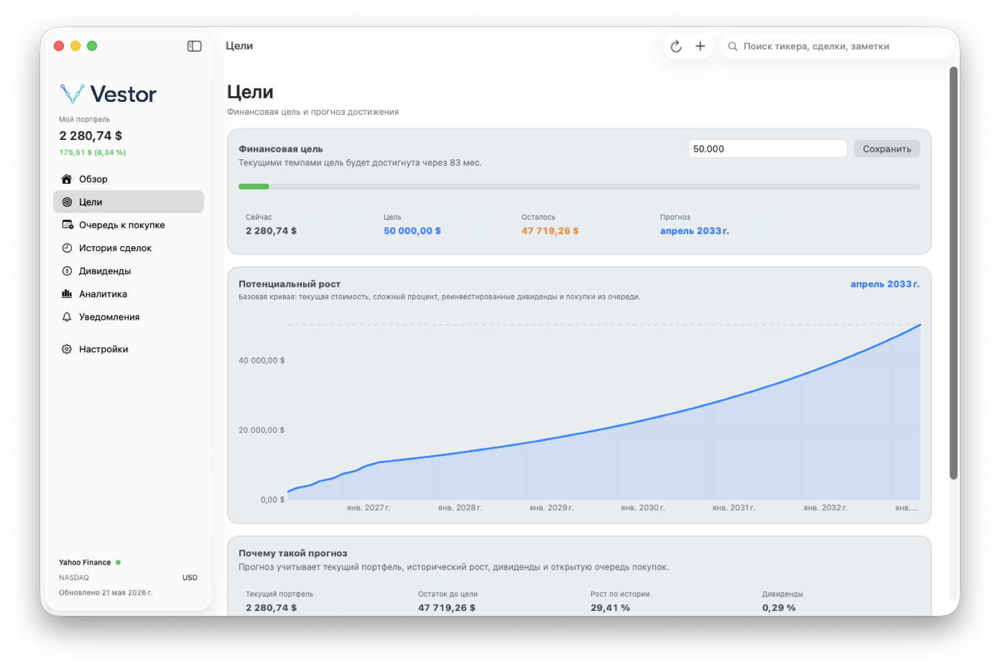
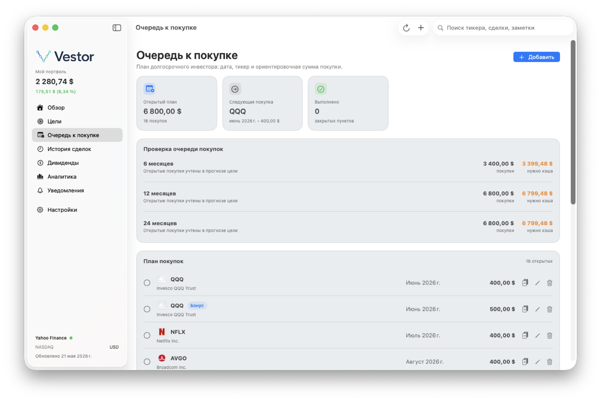
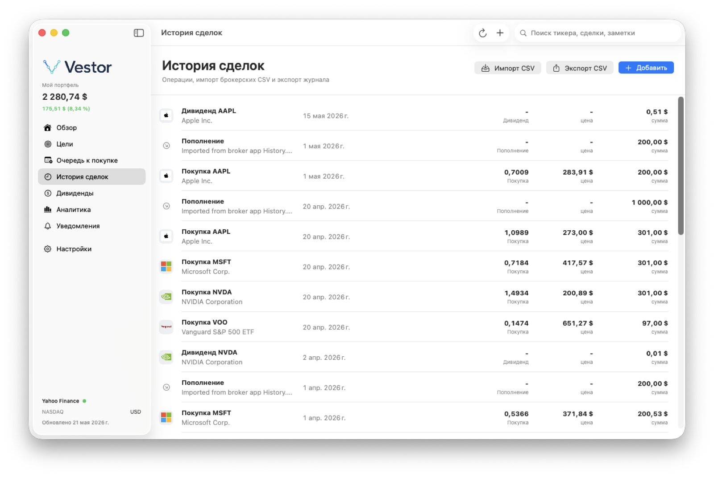
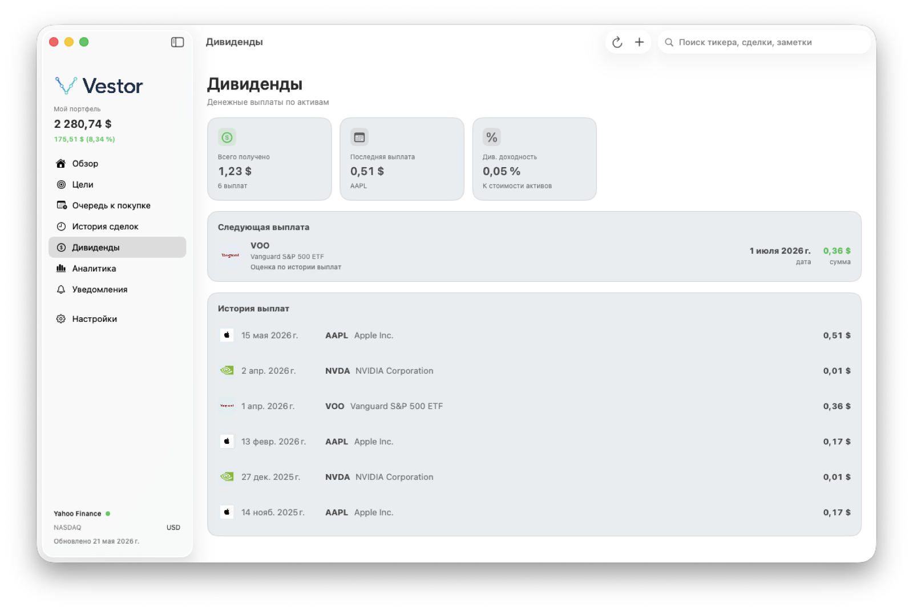
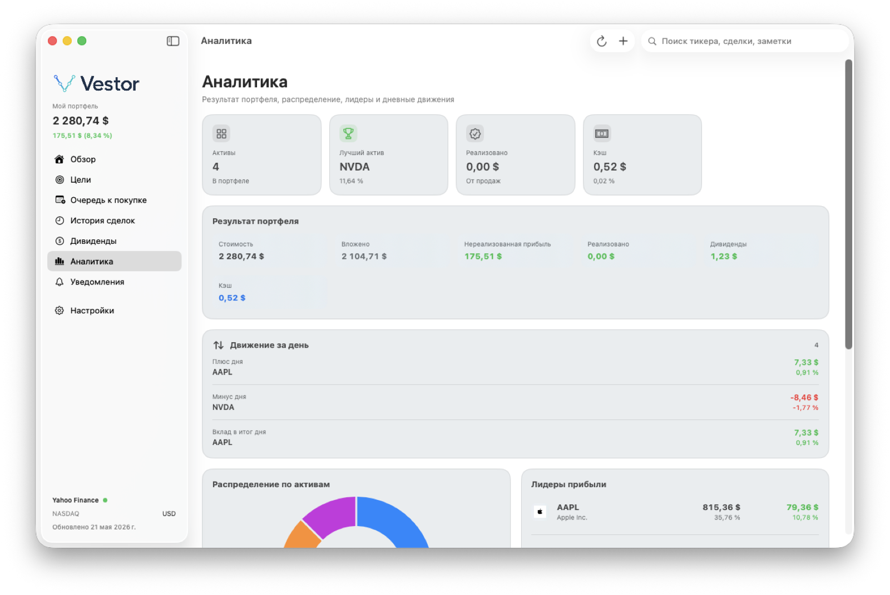
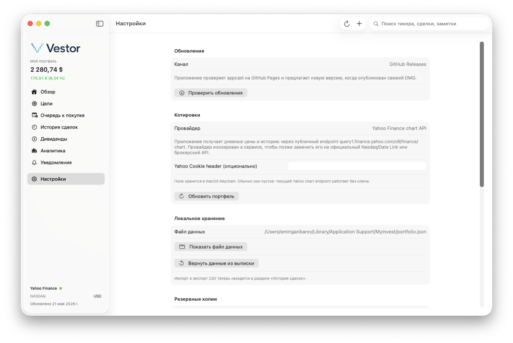

# Vestor

Vestor is a macOS portfolio tracker for long-term investors. It keeps portfolio data local, tracks holdings and cash, monitors dividends, manages a planned purchase queue, and shows goal projections from the current portfolio plus planned contributions.



## Features

- Portfolio overview with market value, day movement, profit/loss, cash, dividends, and data health.
- Goal projection based on current value, historical growth, dividend yield, and planned purchases.
- Planned purchase queue for future contributions.
- Transactions, dividends, analytics, notifications, import workflow, backups, and local undo journal.
- Yahoo Finance chart endpoint for quote and historical price refreshes.
- Local-first storage in the user's macOS Application Support folder.
- Sparkle-powered update feed served from GitHub Pages, with DMG assets hosted on GitHub Releases.

## Screenshots

These screenshots are captured from a live Vestor app run.

| Overview | Goals |
| --- | --- |
|  |  |

| Purchase queue | Transactions |
| --- | --- |
|  |  |

| Dividends | Analytics |
| --- | --- |
|  |  |

| Settings |
| --- |
|  |

## Install

Download the latest QA DMG from the [Vestor releases](https://github.com/GanbarovEmin/Vestor/releases).

This first public build is unsigned and not notarized. macOS may show an unidentified-developer warning. For personal QA, open it from Finder with Control-click, then choose Open.

## Updates

Installed builds check:

```text
https://ganbarovemin.github.io/Vestor/appcast.xml
```

Future deploys publish a new GitHub Release DMG and update the appcast so the installed app can offer the new version.

## Development

```bash
swift test
./script/build_and_run.sh --verify
./script/qa_release.sh
```

Build the release bundle and DMG:

```bash
./script/build_release.sh
./script/create_dmg.sh
```

## Privacy

Portfolio data, import presets, backup files, and the optional Yahoo Cookie header are stored locally. The cookie header is stored in macOS Keychain. Do not commit Application Support data, screenshots containing private portfolio values, credentials, or private Sparkle signing keys.

## Distribution Status

- Repository: public
- DMG: unsigned QA build
- Notarization: not configured
- Update channel: GitHub Pages appcast and GitHub Releases assets
